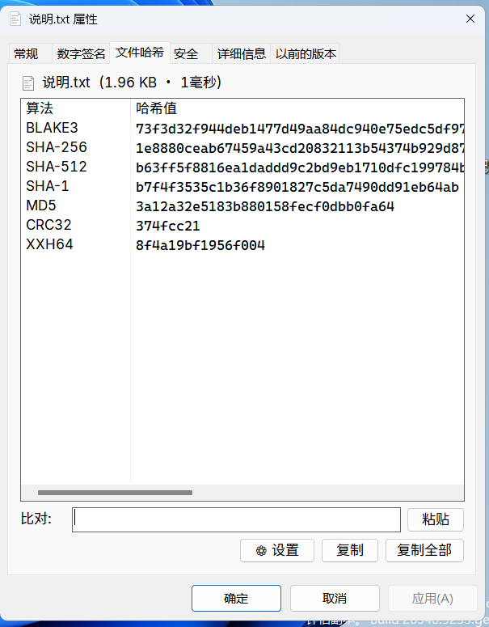

# LightHashTab

A lightweight, high-performance, modern Windows Explorer Property Sheet Shell Extension built in **C# (.NET NativeAOT)**, inspired by [OpenHashTab](https://github.com/namazso/OpenHashTab).

It embeds a **"文件哈希"** tab directly into Windows Explorer's file Properties dialog, offering rapid multi-algorithm hash calculation (including **BLAKE3**), instant hash comparison, clipboard copying, and dark mode support with an ultra-low memory and disk footprint (~2.0 MB standalone unmanaged DLL).



---

## ✨ Features

- **🚀 NativeAOT Unmanaged Shell Extension**: Compiles directly to a standalone native dynamic link library (`LightHashTab.dll`) with zero CoreCLR host overhead and fast startup (<10ms).
- **⚡ High-Performance Multi-Hashing**:
  - **BLAKE3** (Managed SIMD hardware-accelerated with AVX2/SSE)
  - **SHA-256**, **SHA-512**, **SHA-384**, **SHA-1**, **MD5** (.NET hardware-accelerated cryptography)
  - **CRC32**, **XXH64**, **XXH128** (`System.IO.Hashing`)
  - Single-pass chunked streaming I/O — file is read only once.
- **🔍 Live Hash Matching**: Paste any checksum into the comparison box to instantly highlight the matching algorithm (✔ Match / ✖ No match).
- **📋 One-Click Copying**: Copy single hash values or export formatted summaries to clipboard.
- **🎨 Native Explorer UI & Dark Mode**: Lightweight Win32 controls (`SysListView32`, `msctls_progress32`) styled with Windows Explorer themes (`uxtheme`), with DPI scaling support.

---

## 🛠️ Building from Source

### Prerequisites
- .NET 10 (or .NET 8 / 9) SDK
- Visual Studio C++ Build Tools (MSVC Linker for NativeAOT)

### Build & Publish
```powershell
dotnet publish src/LightHashTab/LightHashTab.csproj -c Release -r win-x64
```
The compiled standalone DLL will be located at:
`src/LightHashTab/bin/Release/net10.0-windows/win-x64/publish/LightHashTab.dll`

---

## 📦 Installation

LightHashTab is a fully standalone native DLL. It requires **no administrator privileges** and **no .NET runtime**.

1. Download the latest `LightHashTab-x.x.x-win-x64.zip` from the [Releases](https://github.com/silentmoooon/LightHashTab/releases) page.
2. Extract the archive to any temporary folder.
3. Double-click **`install.cmd`** to register the extension.
   - *The script will automatically copy the DLL to your user directory (`%LOCALAPPDATA%\Programs\LightHashTab`) and register the COM object for the current user.*

You can now right-click any file in Windows Explorer, select **Properties**, and find the **文件哈希** tab!

### Uninstallation

To remove LightHashTab, double-click the **`uninstall.cmd`** script included in the release zip. This will cleanly unregister the extension and delete the DLL.

---

## 🧪 Testing

Run automated tests:
```powershell
dotnet test
```
